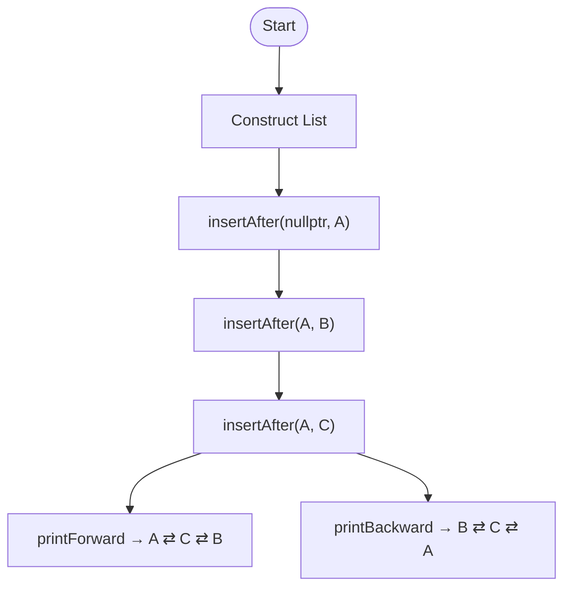
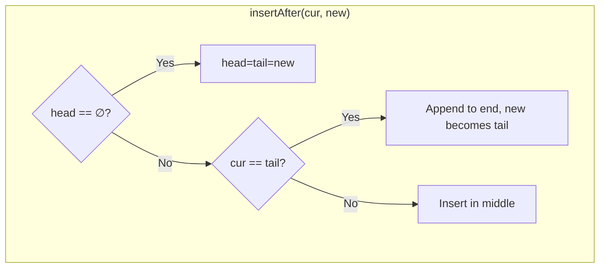

<p align="center">
  
  
  
  
  
  
  
</p>

<pre>
  <p align="center">
╔════════════════════════════════════════════════════════════════════════════════════╗
║                                                                                    ║
║                 ██████╗ ██╗   ██╗██████╗ ██╗     ██╗███╗   ██╗██╗  ██╗             ║
║                 ██╔══██╗██║   ██║██╔══██╗██║     ██║████╗  ██║╚██╗██╔╝             ║
║                 ██║  ██║██║   ██║██████╔╝██║     ██║██╔██╗ ██║ ╚███╔╝              ║
║                 ██║  ██║██║   ██║██╔══██╗██║     ██║██║╚██╗██║ ██╔██╗              ║
║                 ██████╔╝╚██████╔╝██████╔╝███████╗██║██║ ╚████║██╔╝ ██╗             ║
║                 ╚═════╝  ╚═════╝ ╚═════╝ ╚══════╝╚═╝╚═╝  ╚═══╝╚═╝  ╚═╝             ║
║                                                                                    ║
║                     ▓▓▓▓▓▓▓▓▓▓▓▓▓▓▓▓▓▓▓▓▓▓▓▓▓▓▓▓▓▓▓▓▓▓▓▓▓▓                         ║
║                     ▓ Doubly Linked List Implementation  ▓                         ║
║                     ▓▓▓▓▓▓▓▓▓▓▓▓▓▓▓▓▓▓▓▓▓▓▓▓▓▓▓▓▓▓▓▓▓▓▓▓▓▓                         ║
║                                 Justin Guida                                       ║
╚════════════════════════════════════════════════════════════════════════════════════╝
    <p align="center">
</pre>

<p align="center">
  
  
  
  
</p>


# Doubly Linked List Demo

A C++ demo project that implements a generic doubly linked list with a simple terminal UI.
Features:
- Insert, remove, and traverse nodes
- Colorized output and menu navigation
- Debug checks for safe operations

An educational walkthrough of doubly-linked list operations with:
- Clean C++ implementations (insertAfter, insertBefore, remove, detach, clear)
- Flowcharts (Mermaid + ASCII) of control flow and pointer changes
- A generic templated list + interactive REPL demo
- Polished scripts that work after clone or zip

`main.cpp` has easy-to-read code and comments so you can understand how the basic operations work.


## Table of contents
- [Quick Start](#quick-start-works-for-everyone)
- [Demos](#demos)
- [UI Customization](#ui-customization-optional)
- [Program Flow](#program-flow-high-level)
- [API](#api-core--generic)
- [Build](#build)
- [Interactive REPL](#interactive-repl-generic-demo)
- [Repository](#repository)
- [Troubleshooting](#troubleshooting-macos)

---
## Interactive REPL/Commands


## Demo of Commands


## Simple Demo Integers


## Simple Demo Strings


## Quick Start (works for everyone)


**Recommended (git clone)**
```bash
git clone https://github.com/jguida941/doubly_linked_list_demo.git
cd doubly_linked_list_demo
bash scripts/bootstrap_mac.command     # macOS one-time (exec + quarantine + noexec check)
make run                               # educational demo
make run-generic                       # interactive REPL (templated list)
```

**ZIP users on macOS**
```bash
# Right-click the unzipped folder → "New Terminal at Folder"
bash scripts/bootstrap_mac.command
make run
```

**Prefer a double-click app?** After running the bootstrap once, you can also use:
- macOS: double-click `macos/Run Demo.app` (educational)
- macOS: double-click `macos/Run Interactive Demo.app` (interactive REPL)

If Finder says “could not be executed due to access privileges”, your folder is likely on a noexec volume (exFAT/NTFS/SMB). Move it to your home drive (APFS), e.g. `~/Dev/doubly_linked_list_demo`, re-run `bootstrap_mac.command`.

**Windows**: double-click `scripts/Run_Interactive_Demo_Tests.bat` or run the `.ps1` in PowerShell.

---

## Demos

```bash
make run          # Educational demo: prints Forward/Backward once
make run-generic  # Interactive REPL (templated list)
```

### UI Customization (Optional)

The interactive demo (`generic_demo`) can be customized using environment variables:

-   `PRETTY_UI=1`: Enables a modern, colorful UI with borders and banners.
-   `CLEAR_MENU=1`: Clears the screen between main menu displays.
-   `PAUSE_AFTER_SECTIONS=1`: Pauses the program after completing a demo, waiting for the user to press Enter.
-   `PAGINATE_HELP=1`: Paginates the `help` command output in the REPL.
-   `KEEP_LEGACY=0`: Disables the original, plainer output format in the REPL.
-   `TEACH_MODE=1`: Enables extra explanatory output for some REPL commands.

**Example:**
```bash
PRETTY_UI=1 make run-generic
```

**Expected output (educational):**

```
Forward:   A ⇄ C ⇄ B
Backward:  B ⇄ C ⇄ A
```

---

## Program Flow (high-level)


**ASCII Fallback:**
```
Start -> Construct List -> insertAfter(nullptr, A) -> insertAfter(A, B) -> insertAfter(A, C)
  -> printForward → A ⇄ C ⇄ B
  -> printBackward → B ⇄ C ⇄ A
```

### insertAfter Decision Tree


**ASCII Fallback:**
```
insertAfter(cur, new)
  |
  +-- if head is null?
  |   |
  |   +-- Yes: head=tail=new
  |
  +-- No: if cur is tail?
      |
      +-- Yes: Append to end, new becomes tail
      |
      +-- No: Insert in middle
```

---

## API (core & generic)
- **Core demo** (string nodes; `main.cpp`)
  - `bool insertAfter(Node* cur, Node* n)`
  - `bool remove(Node* n)` - deletes
  - `bool detach(Node* n)` - unlinks only
  - `void clear()` - destructor uses this
  - `printForward()`, `printBackward()`, `size()`, `empty()`
  - Optional `DLLIST_DEBUG_CHECKS` for invariants/membership checks
- **Generic** (template; `include/doubly_linked_list.hpp`)
  - `DoublyLinkedList<T>` with `Node<T>`
  - Adds `insertBefore`, `push_front`, `push_back`
  - Same removal/detach/clear/traversals

---

## Build

**Make (macOS/Linux):**
```bash
make all         # builds educational + generic demos
make run         # educational demo
make run-generic # templated demo + REPL
make test        # smoke tests
make clean
```

**CMake (optional):**
```bash
mkdir -p build && cd build
cmake ..
cmake --build .
./doubly_linked_list_demo
./generic_demo
```

---

## Interactive REPL (generic demo)

**Commands:**
- `help` (or `commands`): Displays the help menu.
- `push_front VALUE` (alias: `pf`): Adds a value to the front of the list.
- `push_back VALUE` (alias: `pb`): Adds a value to the end of the list.
- `insert_after INDEX VALUE`: Inserts a value after the specified index.
- `insert_before INDEX VALUE`: Inserts a value before the specified index.
- `remove_at INDEX` (alias: `rm`): Removes the node at the specified index.
- `detach_at INDEX`: Detaches the node at the specified index without deleting it.
- `clear`: Removes all nodes from the list.
- `find VALUE`: Searches for a value in the list and returns the index.
- `print`: Prints the list from head to tail.
- `print_rev`: Prints the list from tail to head.
- `size`: Displays the number of nodes in the list.
- `status`: Displays the current status of the list and UI settings.
- `debug on|off`: Enables or disables debug mode.
- `dump`: Dumps the memory addresses of the nodes (requires debug mode to be on).
- `cls`: Clears the screen.
- `menu` (alias: `m`): Returns to the main menu.
- `quit` (alias: `q`): Exits the application.

**Example:**
```
> print
A ⇄ B ⇄ C
> insert_before 0 Y
ok
> print
Y ⇄ A ⇄ B ⇄ C
```

---

## Repository

```
.
├─ main.cpp
├─ generic_main.cpp
├─ include/
│  └─ doubly_linked_list.hpp
├─ docs/
│  ├─ FLOWCHART_MAIN.md
│  └─ LIST_OPERATIONS.md
├─ scripts/
│  ├─ bootstrap_mac.command
│  ├─ Run_Educational_Demo.command
│  ├─ Run_Interactive_Demo_Tests.command
│  ├─ Run_Interactive_Demo_Tests.ps1
│  ├─ Run_Interactive_Demo_Tests.bat
│  ├─ Setup_Permissions.command
│  └─ Setup-Permissions.ps1
├─ tests/
│  ├─ smoke.sh
│  ├─ test_generic_repl.sh
│  └─ test_dll_demo.sh
├─ macos/
│  ├─ Run Demo.app                # double-click educational demo
│  └─ Run Interactive Demo.app    # double-click interactive REPL (PRETTY_UI)
├─ Makefile
├─ CMakeLists.txt
└─ README.md
```

---

## Troubleshooting (macOS)
- **Quarantine/Gatekeeper**: run `scripts/bootstrap_mac.command`, or right-click a `.command` → Open.
- **Noexec volume**: move repo under `~/Dev/...` (APFS) then run `bootstrap_mac.command`.
- **Finder opens `.command` in editor**: Get Info → “Open With: Terminal” → “Change All”.
