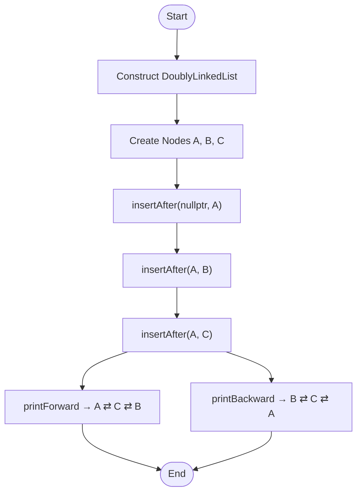
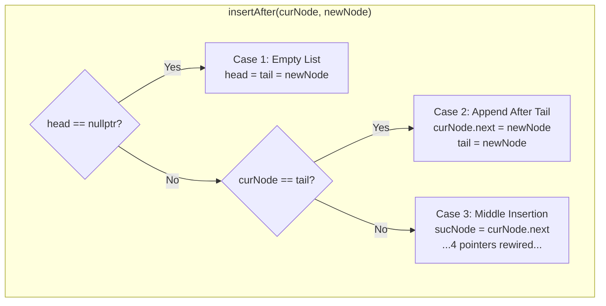
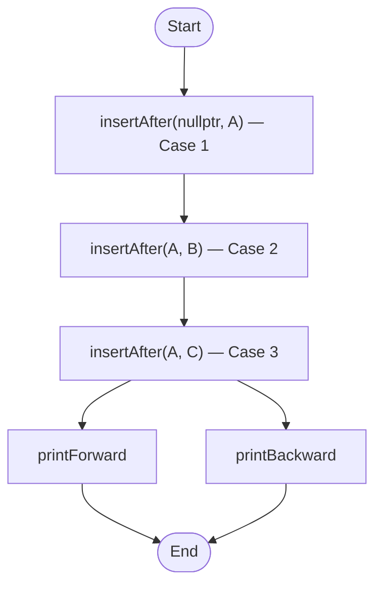
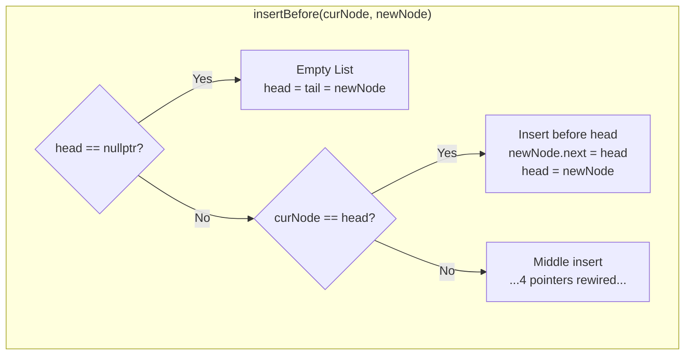
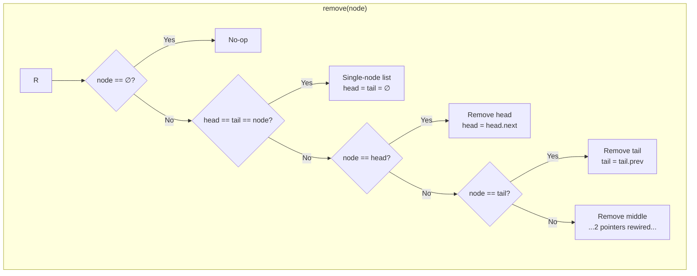
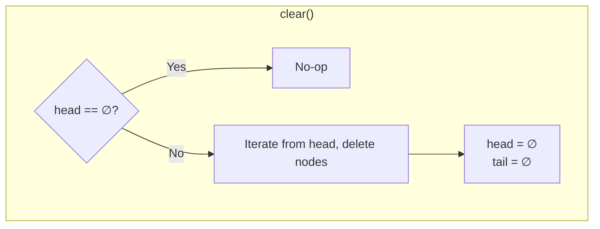
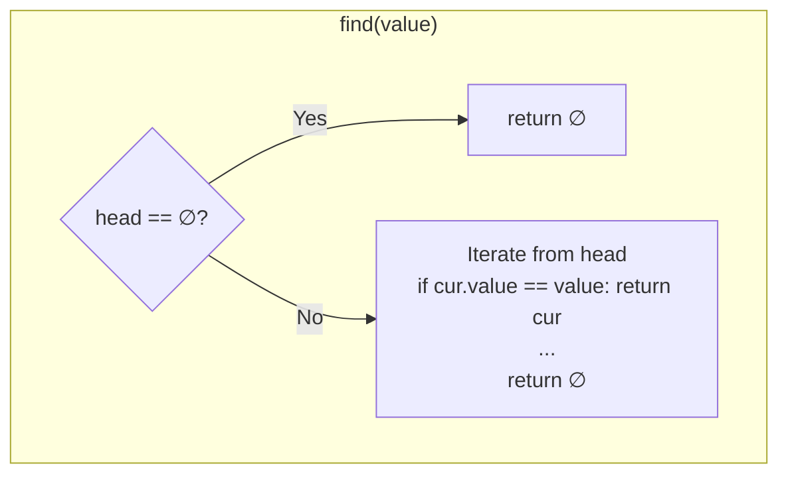
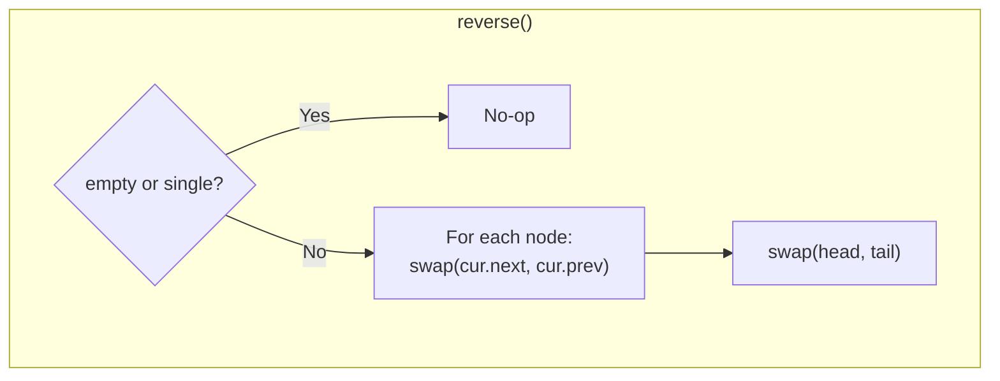

# Doubly Linked List: Flowchart Deep Dive
An extended, educational walkthrough of `main.cpp` using Mermaid for logic and compact ASCII for node states.

(Companion doc for `main.cpp` in this repo. Start with `README.md` for the overview.)

## Program Flow



## insertAfter Decision Tree



## Case Studies

### Case 1: Empty List
New node becomes both head and tail.

Before:
```
head -> ∅
tail -> ∅
```

After:
```
head -> [ A ] <- tail
```

Expanded pointers:
- head = tail = A
- A.prev = ∅
- A.next = ∅

Effect: Node A is the sole element; list length becomes 1.

---

### Case 2: Append After Tail
curNode is the tail; append at the end.

Before:
```
head -> [ A ] <- tail
```

After:
```
head -> [ A ] -> [ B ] <- tail
```

Expanded pointers:
- A.next = B
- B.prev = A
- B.next = ∅
- tail = B

Effect: Node B appended; A.next and B.prev updated; B is new tail.

---

### Case 3:  Middle Insertion
Insert C after A when the list is A -> B.

Before:
```
head -> [ A ] -> [ B ] <- tail
```

After:
```
head -> [ A ] -> [ C ] -> [ B ] <- tail
```

Expanded pointers:
- sucNode = A.next (B)
- C.prev = A
- C.next = B
- A.next = C
- B.prev = C

Effect: Node C spliced between A and B; four pointers rewired (A.next, C.prev, C.next, B.prev).

## Traversals

- Forward:  [ A ] ⇄ [ C ] ⇄ [ B ]
- Backward: [ B ] ⇄ [ C ] ⇄ [ A ]

Note: Forward traversal follows `next` pointers; backward traversal follows `prev` pointers.

## End-to-End Summary



## Notes

- Bracketed terms like `[ A ]` are nodes; arrows indicate pointer direction or control flow as context requires.
- The three `insertAfter` cases are mutually exclusive and cover empty, tail-append, and middle splice.
- In this program run: Case 1 → Case 2 → Case 3.

### Ownership and Debug Checks

- Ownership: the list owns nodes that are inserted; `remove(node)` and the destructor free them.
- `insertAfter` returns `bool` (success/failure) and includes guards (null, self-insert, already-linked).
- Additional APIs: `remove(node)` unlinks and deletes in O(1); `detach(node)` unlinks without delete; `clear()` deletes all nodes.
- Optional safety: compile with `-DDLLIST_DEBUG_CHECKS` to enable membership checks and runtime invariants (also runs a small `sanity()` check in `main`).

### Main Program Outline

- Construct empty list → allocate nodes `A`, `B`, `C` (detached).
- Insert: `insertAfter(nullptr, A)`, then `insertAfter(A, B)`, then `insertAfter(A, C)`.
- Print forward and backward; on exit, destructor calls `clear()` to free nodes.
- When compiled with `-DDLLIST_DEBUG_CHECKS`, each mutation is followed by a quick `sanity()` invariant check.

Note on Generic Version
- The templated header (`include/doubly_linked_list.hpp`) adds `insertBefore`, `push_front`, and `push_back` for broader usage with any `T`. The core flow remains the same; the additional operations just introduce symmetric “before-head” and convenience insertions. A REPL in `generic_main.cpp` demonstrates these.

### REPL Commands (generic_main.cpp)

- push_front VALUE, push_back VALUE
- insert_after INDEX VALUE, insert_before INDEX VALUE
- remove_at INDEX, detach_at INDEX
- find VALUE, clear, print, print_rev, size
- menu (return to main menu), quit

## insertBefore — Decision Tree and Cases



Snapshots

Before:
```
head -> [ A ] -> [ C ] -> [ D ] <- tail
```

After (insert X before C):
```
head -> [ A ] -> [ X ] -> [ C ] -> [ D ] <- tail
```

---

## remove(node) — Decision Tree and Cases



Snapshots

- Remove head

Before:
```
head -> [ A ] -> [ B ] -> [ C ] <- tail
```

After:
```
head -> [ B ] -> [ C ] <- tail
```

- Remove tail

Before:
```
head -> [ A ] -> [ B ] -> [ C ] <- tail
```

After:
```
head -> [ A ] -> [ B ] <- tail
```

- Remove middle

Before:
```
head -> [ A ] -> [ X ] -> [ C ] <- tail
```

After:
```
head -> [ A ] -> [ C ] <- tail
```

- Single-node list

Before/After:
```
head -> [ A ] <- tail   ==>   head -> ∅, tail -> ∅
```

---

## clear() — Decision Tree and Effect



Effect

Before:
```
head -> [ A ] -> [ B ] -> [ C ] <- tail
```

After:
```
head -> ∅
tail -> ∅
```

---

## find(value) — Decision Tree and Example



Example

```
head -> [ A ] -> [ C ] -> [ B ] <- tail

find("C")  => returns node [ C ]
find("Z")  => returns ∅
```

---

## reverse() — Decision Tree and Before/After



Before/After

Before:
```
head -> [ A ] -> [ B ] -> [ C ] <- tail
```

After:
```
head -> [ C ] -> [ B ] -> [ A ] <- tail
```

## Future Work
 
- Possible extensions beyond what’s diagrammed here: `insertAt(index)`, `removeAt(index)`, iterators, and range-based traversal examples.